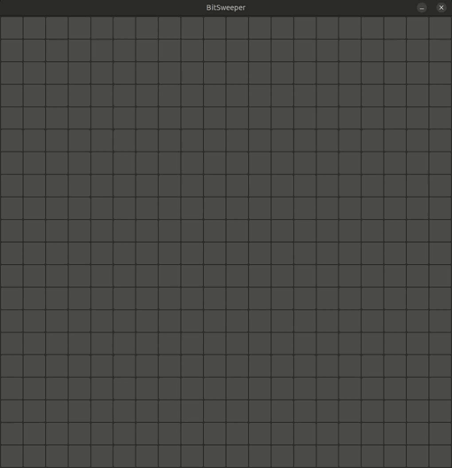
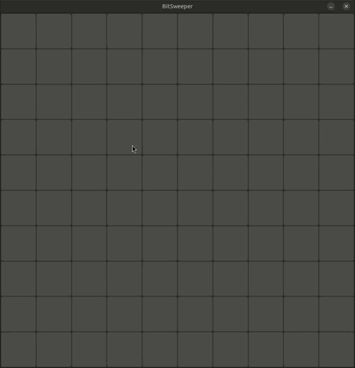
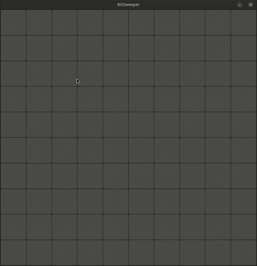
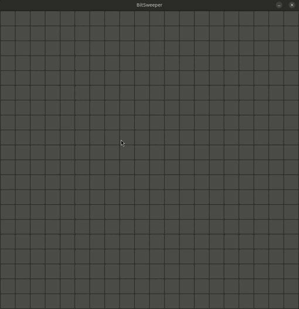

# 💣️ **Bit-sweeper** 💥







## 📃 Description

Minesweeper game clone. Written in C (btw) (and I'm very proud of it). Valgrind said no memory leaks.

## 🔧 Developed using

[](#)
[](#)

## 🖥️ Platforms

[](#)
[](#)

## 🎮 **How to play**

Clone this repo, pull github submodules for raylib and unity (no, not Unity, the testing framework), build with CMake and run:

```
$ git submodule update --recursive
$ cmake -B build -S .
$ cd build && make
$ cd ui && ./bitsweeper-game
```
